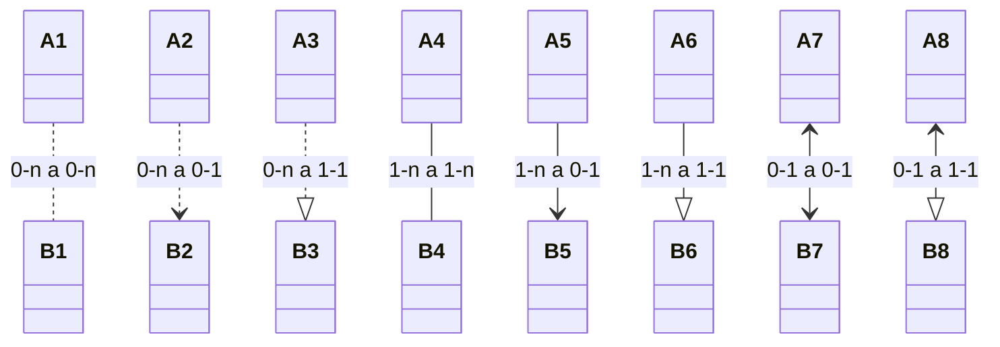
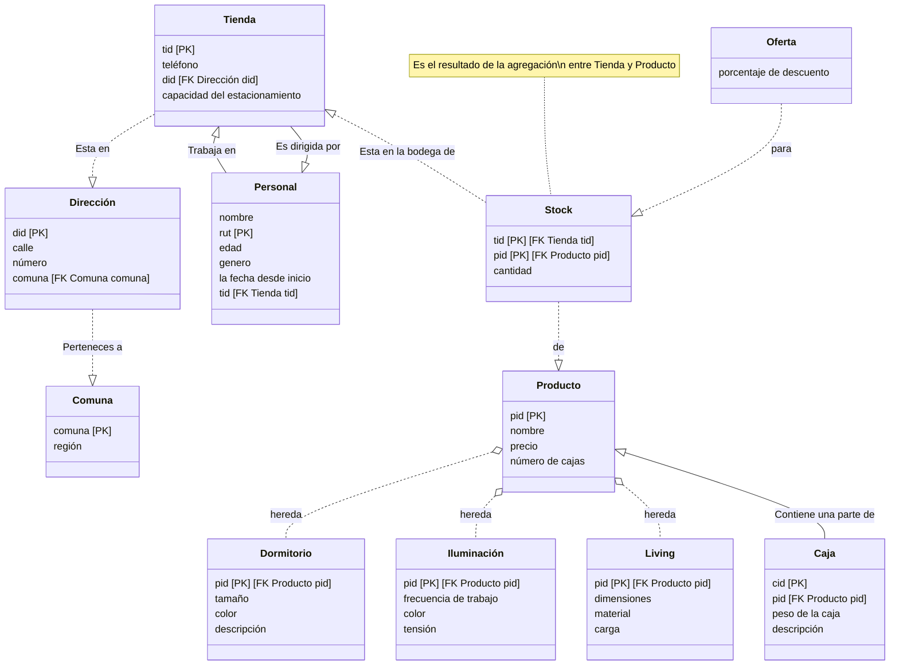

# Tarea 2 de Base de Datos

- Daniel Orlando Ortiz Pacheco

## Diagrama E/R

Antes de mostrar el diagrama entidad relación se muestra una leyenda de la simbología que se usará. En la leyenda se muestran entidades Ai y Bi que ejemplifican cada una de las relaciones posibles. Dichas relaciones presentan la multiplicidad que estas describen en su interior, véase como en el **segundo** ejemplo se relaciona la entidad A2 con la entidad B2 donde se relacionan 0 o n entidades de A2 con 0 o 1 entidad de B2. Lease de forma análoga al ejemplo anterior el resto de las relaciones



Cada una de las entidades del diagrama E/R contiene en el interior del recuadro las propiedades de la entidad en cuestión. Para señala las llaves primarias de cada una de las entidades se usa el tag `[PK]`, y para el caso de las llaves foráneas se usa la sintaxis `[FK <nombre de la entidad> <propiedad a la que hace referencia>]`



## Esquema Relacional

**Tienda**( \
$\space\space$ tid `int PRIMARY KEY`, \
$\space\space$ teléfono `string`, \
$\space\space$ Comuna.comuna `string`, \
$\space\space$ capacidad de estacionamiento `int`) \
**Personal**( \
$\space\space$ nombre `string`, \
$\space\space$ rut `string PRIMARY KEY`, \
$\space\space$ edad `int`, \
$\space\space$ genero `string`, \
$\space\space$ la fecha desde inicio `date`, \
$\space\space$ Tienda.tid `int`) \
**EsDirigidaPor**(\
$\space\space$ Tienda.tid `int PRIMARY KEY`, \
$\space\space$ Personal.rut `string`)\
**Comuna**(
$\space\space$ comuna `string PRIMARY KEY`,\
$\space\space$ region `string`)

**Producto**(
$\space\space$ pid `int PRIMARY KEY`,\
$\space\space$ nombre `string`,\
$\space\space$ precio `float`,\
$\space\space$ número de cajas `int`) \
**Dormitorio**(\
$\space\space$ Producto.pid `int PRIMARY KEY`,\
$\space\space$ tamaño `float`,\
$\space\space$ color `string`,\
$\space\space$ descripción `string`) \
**Iluminación**(\
$\space\space$ Producto.pid `int PRIMARY KEY`,\
$\space\space$ frecuencia `float`,\
$\space\space$ color `string`,\
$\space\space$ tensión `float`) \
**Living**(\
$\space\space$ Producto.pid `int PRIMARY KEY`,\
$\space\space$ dimensiones `string`,\
$\space\space$ material `string`,\
$\space\space$ carga `string`)\
**Caja**(\
$\space\space$ cid `int PRIMARY KEY`,\
$\space\space$ Producto.pid `int`,\
$\space\space$ peso de la caja `float`,\
$\space\space$ descripción `string`)

**Stock**(\
$\space\space$ Tienda.tid `int PRIMARY KEY`,\
$\space\space$ Producto.pid `int PRIMARY KEY`,\
$\space\space$ cantidad `int`) \
**Oferta**(\
$\space\space$ oid `int PRIMARY KEY`,\
$\space\space$ Tienda.tid `int`,\
$\space\space$ Producto.pid `int`,\
$\space\space$ porcentaje de descuento `float`)

`Nota`: Nótese que al traducir el diagrama E/R al esquema relacional presenciamos la posibilidad de dos violaciones de las reglas del domino. En la interacción entre las entidades Tienda y Personal, con el esquema relacional presentado podría existir un jefe de una tienda que no trabaje en dicha tienda. Y la entidad Oferta tiene como llaves el id de la Tienda y del Producto, por tanto, es posible crear una oferta para un producto sin Stock.

## Esquema SQL

```sql
CREATE TABLE Comuna(
  comuna varchar(30) PRIMARY KEY,
  region varchar(30) NOT NULL
);

CREATE TABLE Direccion(
  id SERIAL PRIMARY KEY,
  calle varchar(30) NOT NULL,
  numero int NOT NULL CHECK (numero > 0),
  comuna varchar(30) NOT NULL,
  FOREIGN KEY(comuna) REFERENCES Comuna(comuna) ON DELETE SET NULL
);

CREATE TABLE Tienda(
    id SERIAL PRIMARY KEY,
    teléfono varchar(15) NOT NULL,
    DireccionId int NOT NULL,
    capacidadDeEstacionamiento int DEFAULT 0,
    FOREIGN KEY(DireccionId) REFERENCES Direccion(id) ON DELETE SET NULL
);
```

Para modelar mejor el domino del problem y eliminar la violación de una de las reglas de domino antes descrita se modela la relación `EsDirigidaPor` aprovechándose de las características de los constraints. Como en general los constraint ignoran los valores NULLs entonces si se define una propiedad `esJefeDeLaTienda` booleana que puede ser NULL. A dicha propiedad se le define dos restricciones:

- Solo puede tener el valor True (en caso de no ser NULL)
- Es única junto a la TiendaId (por lo que para cada TiendaId solo hay una tupla con True en la propiedad esJefeDeLaTienda, el resto son NULLs)

```sql
CREATE TABLE Personal(
    rut varchar(30) PRIMARY KEY,
    nombre varchar(30) NOT NULL,
    edad int DEFAULT 18 CHECK ( edad >= 18 ),
    genero varchar(30) DEFAULT NULL,
    fechaDeInicio date DEFAULT NOW(),
    TiendaId int NOT NULL,
    esJefeDeLaTienda boolean DEFAULT NULL CHECK (esJefeDeLaTienda = TRUE),
    FOREIGN KEY(TiendaId) REFERENCES Tienda(id) ON DELETE CASCADE,
    CONSTRAINT UC_Only_One_Boss UNIQUE (TiendaId, esJefeDeLaTienda)
);

CREATE TABLE Producto(
    id SERIAL PRIMARY KEY,
    nombre varchar(30) NOT NULL,
    precio float NOT NULL CHECK ( precio >= 0 ),
    numeroDeCajas int DEFAULT 1 CHECK ( numeroDeCajas >= 1 )
);

CREATE TABLE Dormitorio(
    ProductoId int PRIMARY KEY,
    tamaño float NOT NULL CHECK ( tamaño > 0 ),
    color varchar(30) NOT NULL,
    descripción varchar(512),
    FOREIGN KEY(ProductoId) REFERENCES Producto(id) ON DELETE CASCADE
);

CREATE TABLE Iluminacion(
    ProductoId int PRIMARY KEY,
    frecuencia float NOT NULL,
    color varchar(30) NOT NULL,
    tensión float NOT NULL,
    FOREIGN KEY(ProductoId) REFERENCES Producto(id) ON DELETE CASCADE
);

CREATE TABLE Living(
    ProductoId int PRIMARY KEY,
    dimensiones varchar(30) NOT NULL,
    material varchar(30) NOT NULL,
    carga varchar(30) NOT NULL,
    FOREIGN KEY(ProductoId) REFERENCES Producto(id) ON DELETE CASCADE
);

CREATE TABLE Caja(
    id SERIAL PRIMARY KEY,
    ProductoId int NOT NULL,
    peso float NOT NULL CHECK ( peso > 0 ),
    descripción varchar(512) DEFAULT NULL,
    FOREIGN KEY(ProductoId) REFERENCES Producto(id) ON DELETE CASCADE
);

CREATE TABLE Stock(
    TiendaId int NOT NULL,
    ProductoId int NOT NULL,
    cantidad float DEFAULT 0 CHECK ( cantidad >= 0 ),
    PRIMARY KEY (TiendaId, ProductoId),
    FOREIGN KEY(ProductoId) REFERENCES Producto(id) ON DELETE CASCADE,
    FOREIGN KEY(TiendaId) REFERENCES Tienda(id) ON DELETE CASCADE
);
```

Finalmente para eliminar la otra violación comenta, basta con usar los ids de Tienda y Producto para referenciar a la tabla Stock y no a las tablas Tienda y Producto. En principio esto podría provocar que dichos ids no fueran ids reales de dichas tablas, pero como se puede ver en la definición de la tabla Stock esta garantiza que su llave compuesta son ids de las tablas Tienda y Producto respectivamente por lo que de forma transitiva la integridad esta garantizada.

```sql
CREATE TABLE Oferta(
    id SERIAL PRIMARY KEY,
    TiendaId int NOT NULL,
    ProductoId int NOT NULL,
    porCiento float DEFAULT 1 CHECK ( porCiento >= 1 AND porCiento <= 99 ),
    FOREIGN KEY(TiendaId, ProductoId) REFERENCES Stock(TiendaId, ProductoId) ON DELETE CASCADE
);

```

## Dependencias

En el modelo presentado, cada una de las tablas solo aplican dependencias funcionales triviales y del conjunto de llaves hacia el conjunto no llave de cada tabla. A excepción de la tabla `Personal` donde aparece la siguiente dependencia funcional:

$$
(\space rut, \space esJefeDeLaTienda \space ) \rightarrow \space TiendaId
$$

La semántica de dicha dependencia funcional ya se comento anteriormente, esta describe la regla del domino que hace referencia a que una tiende solo puede tener un jefe, el cual lógicamente debe trabajar en la misma.

Como existe esta dependecia funcional en la tabla `Personal` entonces el modelo presentado no se encuentra ni en 3FN ni BCNF. Para llevar el modelo a 3FN basta con extraer esta dependencia funcional de la tabla `Personal` y crear una nueva tabla para esta. Lo que es análogo a seguir el primer diseño presentado con donde no existe el campo `esJefeDeLaTienda` y en su lugar se describe la tabla **EsDirigidaPor**(Tienda.tid `int PRIMARY KEY`, Personal.rut `string`). Pero como se comentó anteriormente este modelo presenta una anomalía de inserción con respecto a las reglas del domino.

## Consultas

1 - Muestre los nombres de los cinco productos más carros de cada categoría de los productos, junto con su precio.Noten que un producto puede tener varios precios. Para su cómputo no es necesario aplicar ofertas a los productos,sino considerar solo el precio base.

```sql
SELECT *
FROM (
  SELECT nombre, precio
  FROM Dormitorio
  LEFT JOIN Producto ON id = ProductoId
  ORDER BY precio DESC
  LIMIT 5
) as d
UNION
SELECT *
FROM (
  SELECT nombre, precio
  FROM Iluminacion
  LEFT JOIN Producto ON id = ProductoId
  ORDER BY precio DESC
  LIMIT 5
) as i
UNION
SELECT *
FROM (
  SELECT nombre, precio
  FROM Living
  LEFT JOIN Producto ON id = ProductoId
  ORDER BY precio DESC
  LIMIT 5
) as i
ORDER BY nombre;
```

2 - Liste nombres de todos los jefes de una tienda ubicada en la Región Metropolitana

```sql
CREATE VIEW TiendaFullDireccion AS
  SELECT t.id, t.teléfono, t.capacidadDeEstacionamiento, d.calle, d.numero, c.comuna, c.region
  FROM Tienda as t, Direccion as d, Comuna as c
  WHERE t.DireccionId = d.id AND d.comuna = c.comuna;

SELECT p.nombre
FROM Personal as p, TiendaFullDireccion as t
WHERE p.esJefeDeLaTienda = True AND p.TiendaId = t.id AND t.region = 'Metropolitana';
```

3 - Para el producto con el id = 177857, liste el nombre del producto, el número de cajas necesarias para entregar este producto, y el peso total de todas las cajas necesarias para guardar este producto.

```sql
SELECT p.nombre, SUM(c.peso)
FROM Caja as c, Producto as p
WHERE c.ProductoId = p.id AND p.id = 177857
GROUP BY p.id, p.nombre;
```

4 - Nombra a todos los productos que se encuentran en stock de una tienda de la Región Metropolitana y de la Región de Valparaiso.

```sql
SELECT DISTINCT p.nombre
FROM Stock as s
LEFT JOIN Producto as p ON s.ProductoId = p.id
LEFT JOIN TiendaFullDireccion as t ON s.TiendaId = t.id
WHERE t.region IN ('Metropolitana', 'Valparaíso') AND s.cantidad > 0;
```

5 - Para el producto con el nombre “sillon blanco” listar todas las tiendas de la Región Metropolitana que tienen dicho producto en stock. Adicionalmente, hay que mostrar el precio del producto. Si hay una oferta para el producto en una tienda, mostrar el precio con la oferta.

```sql
SELECT s.TiendaId, p.precio * (100 - o.porCiento) / 100 as precio, o.id, t.teléfono, t.comuna, t.region
FROM Stock as s
INNER JOIN Producto as p ON p.id = s.ProductoId AND p.nombre = 'sillon blanco'
INNER JOIN TiendaFullDireccion as t ON s.TiendaId = t.id AND t.region = 'Metropolitana'
RIGHT JOIN Oferta as o ON t.id = o.TiendaId AND p.id = o.ProductoId;
```

6 - Compute el número total de personas trabajando en las tiendas de la Región Metropolitana.

```sql
SELECT COUNT(*)
FROM Personal as p, TiendaFullDireccion as t
WHERE p.TiendaId = t.id AND t.region = 'Metropolitana';
```

7 - Para cada tienda de la región “Valparaiso” listar el número de personas de cada género trabajando en esta tienda, y su edad promedio (para cada género).

```sql
SELECT t.id, p.genero, COUNT(*), AVG(p.edad) as edad_promedio
FROM Personal as p
INNER JOIN TiendaFullDireccion as t ON p.TiendaId = t.id AND t.region = 'Valparaíso'
GROUP BY t.id, p.genero;
```

8 - Listar, para cada tienda de la región “Valparaiso”, su dirección, y el valor total del stock disponible en esta tienda. Valor del stock de un producto es su precio multiplicado por el número de unidades de este item en el stock. El valor del stock completo es suma de los valores de stock de cada producto que la tienda tiene en el stock. Para este cómputo no es necesario aplicar el descuento que producen las ofertas.

```sql
SELECT t.id, t.calle, t.numero, t.comuna, SUM(s.valor)
FROM (
  SELECT s.TiendaId, p.precio * s.cantidad as valor
  FROM Stock as s
  INNER JOIN Producto as p ON p.id = s.ProductoId
) as s
INNER JOIN TiendaFullDireccion as t ON t.id = s.TiendaId AND t.region = 'Valparaíso'
GROUP BY t.id, t.calle, t.numero, t.comuna;
```
