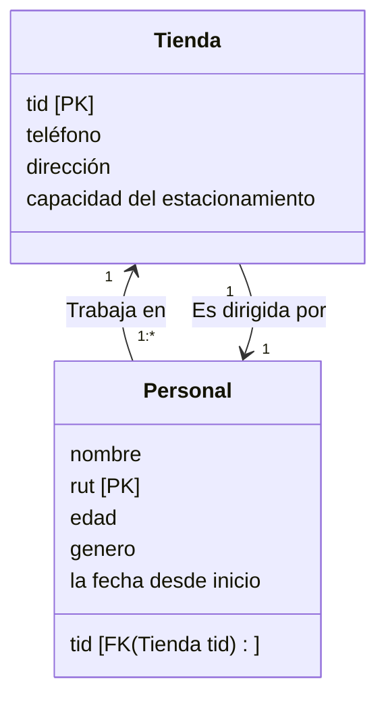

## Diagrama E/R

```mermaid
classDiagram
    Tienda "1" <-- "1:*" Personal : Trabaja en
    Tienda "1" --> "1" Personal  : Es dirigida por

    class Tienda{
        tid [PK]
        teléfono
        dirección
        capacidad del estacionamiento
    }
    class Personal {
        nombre
        rut [PK]
        edad
        genero
        la fecha desde inicio
        tid [FK (Tienda tid)]
    }
```
