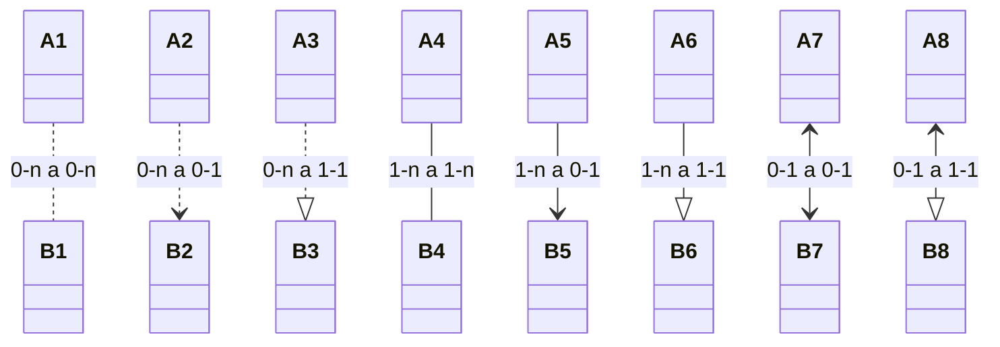
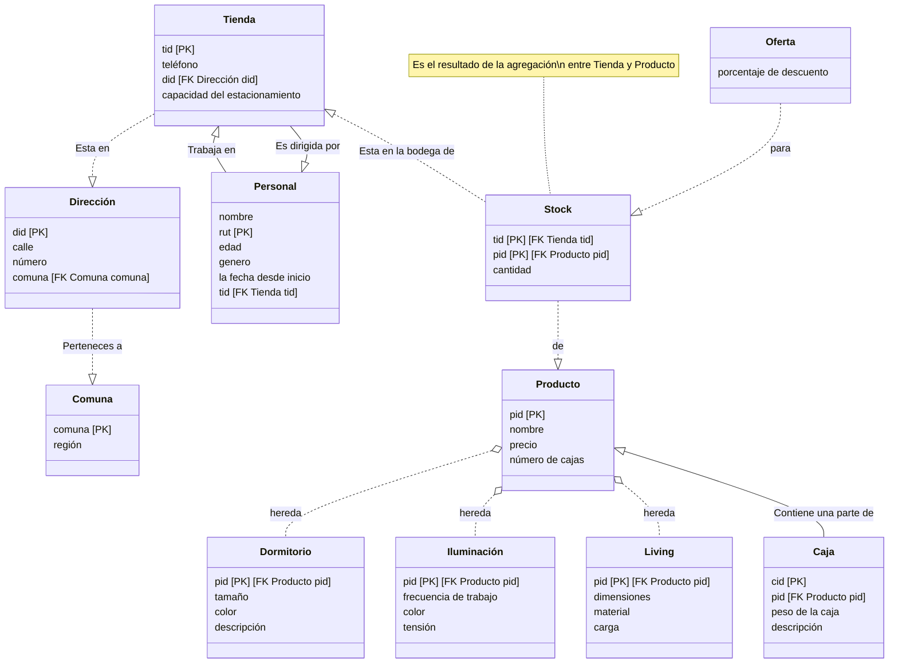

## Diagrama E/R





**Tienda**(tid `int PRIMARY KEY`, teléfono `string`, Comuna.comuna `string`, capacidad de estacionamiento `int`) \
**Personal**(nombre `string`, rut `string PRIMARY KEY`, edad `int`, genero `string`, la fecha desde inicio `date`, Tienda.tid `int`) \
**EsDirigidaPor**(Tienda.tid `int PRIMARY KEY`, Personal.rut `string`)\
**Comuna**(comuna `string PRIMARY KEY`, region `string`)

**Producto**(pid `int PRIMARY KEY`, nombre `string`, precio `float`, número de cajas `int`) \
**Dormitorio**(Producto.pid `int PRIMARY KEY`, tamaño `float`, color `string`, descripción `string`) \
**Iluminación**(Producto.pid `int PRIMARY KEY`, frecuencia `float`, color `string`, tensión `float`) \
**Living**(Producto.pid `int PRIMARY KEY`, dimensiones `string`, material `string`, carga `string`)\
**Caja**(cid `int PRIMARY KEY`, Producto.pid `int`, peso de la caja `float`, descripción `string`)

**Stock**(Tienda.tid `int PRIMARY KEY`, Producto.pid `int PRIMARY KEY`, cantidad `int`) \
**Oferta**(oid `int PRIMARY KEY`, Tienda.tid `int`, Producto.pid `int`, porcentaje de descuento `float`)

```sql
CREATE TABLE Tienda(
    id SERIAL PRIMARY KEY,
    teléfono varchar(15) NOT NULL,
    comuna varchar(30) NOT NULL,
    capacidadDeEstacionamiento int DEFAULT 0,
    FOREIGN KEY(comuna) REFERENCES Comuna(comuna) ON DELETE SET NULL
)

CREATE TABLE Personal(
    rut varchar(30) PRIMARY KEY,
    nombre varchar(30) NOT NULL,
    edad int DEFAULT 18 CHECK ( edad >= 18 ),
    genero varchar(30) DEFAULT NULL,
    fechaDeInicio date DEFAULT NOW(),
    TiendaId int NOT NULL,
    esJefeDeLaTienda boolean DEFAULT NULL,
    FOREIGN KEY(TiendaId) REFERENCES Tienda(id) ON DELETE CASCADE,
    CONSTRAINT UC_Only_One_Boss UNIQUE (TiendaId, esJefeDeLaTienda)
)

CREATE TABLE EsDirigidaPor(
    TiendaId int PRIMARY KEY,
    PersonalRut varchar(30) UNIQUE NOT NULL ,
    FOREIGN KEY(TiendaId) REFERENCES Tienda(id) ON DELETE CASCADE,
    FOREIGN KEY(PersonalRut) REFERENCES Personal(rut) ON DELETE CASCADE
)

CREATE TABLE Producto(
    id SERIAL PRIMARY KEY,
    nombre varchar(30) NOT NULL,
    precio float NOT NULL CHECK ( precio >= 0 ),
    numeroDeCajas int DEFAULT 1 CHECK ( numeroDeCajas >= 1 ),
)

CREATE TABLE Dormitorio(
    ProductId int PRIMARY KEY,
    tamaño float NOT NULL CHECK ( tamaño > 0 ),
    color varchar(30) NOT NULL,
    descripción varchar(512),
    FOREIGN KEY(ProductId) REFERENCES Producto(id) ON DELETE CASCADE,
)

CREATE TABLE Iluminación(
    ProductId int PRIMARY KEY,
    frecuencia float NOT NULL,
    color varchar(30) NOT NULL,
    tensión float NOT NULL,
    FOREIGN KEY(ProductId) REFERENCES Producto(id) ON DELETE CASCADE,
)

CREATE TABLE Living(
    ProductId int PRIMARY KEY,
    dimensiones varchar(30) NOT NULL,
    material varchar(30) NOT NULL,
    carga varchar(30) NOT NULL,
    FOREIGN KEY(ProductId) REFERENCES Producto(id) ON DELETE CASCADE,
)

CREATE TABLE Caja(
    id SERIAL PRIMARY KEY,
    ProductoId int NOT NULL,
    peso float NOT NULL CHECK ( peso > 0 ),
    descripción varchar(512),
    FOREIGN KEY(ProductId) REFERENCES Producto(id) ON DELETE CASCADE,
)

CREATE TABLE Stock(
    TiendaId int NOT NULL,
    ProductoId int NOT NULL,
    cantidad float DEFAULT 0 CHECK ( cantidad >= 0 ),
    PRIMARY KEY (TiendaId, ProductoId)
    FOREIGN KEY(ProductId) REFERENCES Producto(id) ON DELETE CASCADE,
    FOREIGN KEY(TiendaId) REFERENCES Tienda(id) ON DELETE CASCADE,
)

CREATE TABLE Oferta(
    id SERIAL PRIMARY KEY,
    TiendaId int NOT NULL,
    ProductoId int NOT NULL,
    porCiento float DEFAULT 1 CHECK ( porCiento >= 1 AND porCiento <= 99 ),
    FOREIGN KEY(ProductId) REFERENCES Producto(id) ON DELETE CASCADE,
    FOREIGN KEY(TiendaId) REFERENCES Tienda(id) ON DELETE CASCADE,
)

```
